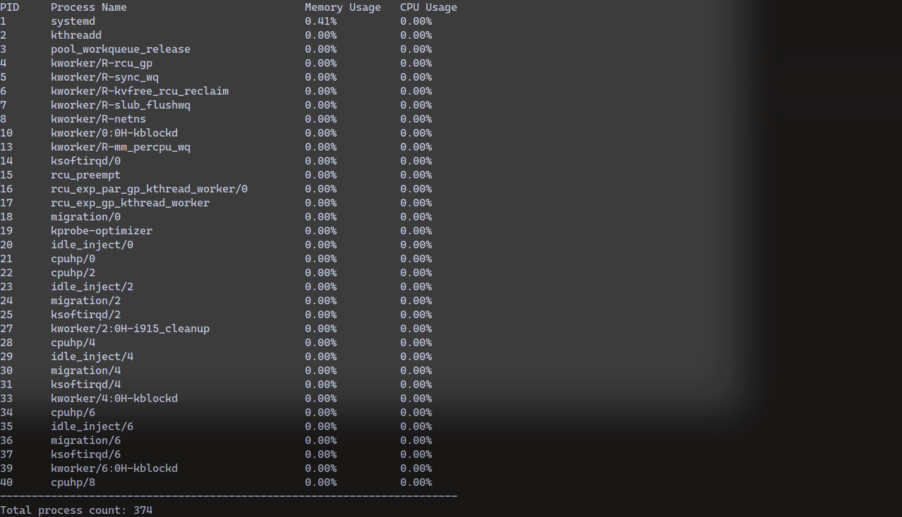

# Task-05: Grand Line Guardian
So this is a very simple clone of htop written in python. 
It's very basic, it simply displays the
- Process ID
- Process Name
- CPU Usage
- Memory Usage
- Total process count 



The output is scrollable by using the up and down keys, and you can press `q` to quit.
This uses the psutil library to get information about processes and the curses library to display them.

## Usage
### Dependencies
- python 
- pip
- ncurses

```bash
python3 -m venv .venv
source .venv/bin/activate

pip install -r requirements.txt
python3 src/main.py # or you can simply run 'make'
```